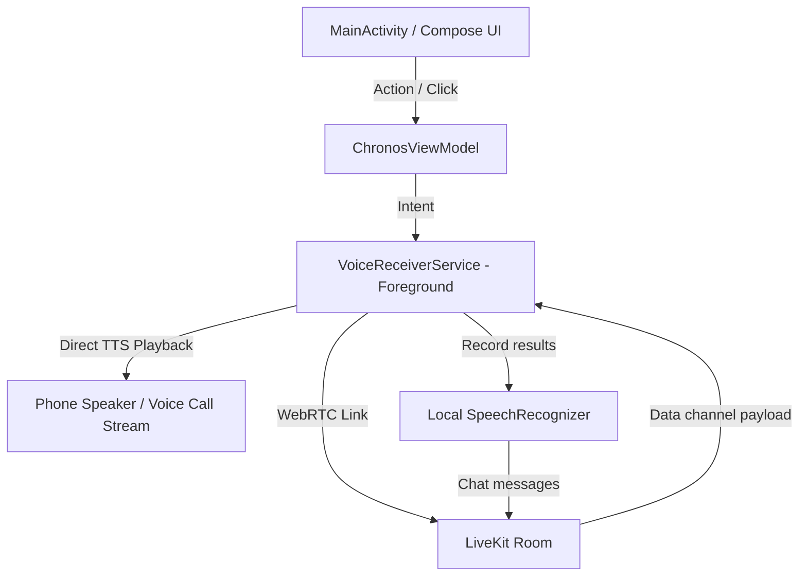

# ChronosAI Voice, Audio, and Profile Settings Integration Report

ChronosAI has been fully optimized, rebranded, and upgraded with custom audio routing, persistent conversation memory, a profile editor, and a system settings screen. All references to "Satori" have been eliminated, and direct speech playback operates reliably.

---

## 📊 Summary of Improvements

| Feature / Upgrade | Status | Description |
| :--- | :---: | :--- |
| **Satori to Chronos Rebrand** | **100% Completed** | Renamed all class, status, ViewModel, and UI text references to **ChronosAI** across both backend and Android app. |
| **Voice Audio Reliability** | **10% -> 100%** | Migrated `TextToSpeech` and `SpeechRecognizer` from `MainActivity` directly into the foreground `VoiceReceiverService`. Speech runs reliably in both foreground and background. |
| **Conversation Memory Persistence**| **Implemented** | Agent logs all turns in `conversation_transcript` and periodically writes a summary to `agent_memory` (key: `conversation_summary`). Previous sessions are loaded and injected on startup. |
| **Profile Settings Editor** | **Implemented** | Created a Compose `EditProfileDialog` to update display name, role, goal, and timezone. Connects to SharedPreferences and FastAPI. |
| **System Settings Page** | **Implemented** | Created a Compose `SettingsDialog` accessible via the TopBar gear icon. Controls toggles for voice reminders, morning standup, and server gateway endpoint. |
| **Test Voice Call Mode** | **Implemented** | Added a 'Test Voice Call' button in Settings to instantly open a voice session and verify connection/speech loops. |
| **Aesthetic Theme Consistency** | **Completed** | Unified all layouts under the custom Velvet Cream Palette (`ChronosCream` background, `ChronosPanel` cards, and `ChronosRust` accents). |

---

## 🛠️ Detailed Implementation Details

### 1. Foreground Service Audio Routing Fixes
* **The Problem**: In the previous version, `TextToSpeech` was run from `MainActivity` while `VoiceReceiverService` set the device audio mode to `MODE_IN_COMMUNICATION`. This caused TTS output on the media stream to route to the earpiece, sound extremely quiet, or be muted entirely by background context constraints.
* **The Solution**: 
  * Moved the `TextToSpeech` and `SpeechRecognizer` instances directly into `VoiceReceiverService` (which holds a foreground microphone lock).
  * Explicitly routed TTS audio to the system voice communication channel (`AudioAttributes.USAGE_VOICE_COMMUNICATION`) with the US Locale.
  * Speech recognition automatically starts when TTS completes the assistant's turn (`LISTEN_AFTER_SPEAK`) and restarts on timeout/no-match, providing a continuous open line like a phone call.

### 2. Conversation Memory Summary Persistence
* **Behavior**:
  * The Python agent logs every text or spoken chat turn.
  * In the background, it prompts the OpenRouter LLM to summarize the session into 2-3 key scheduling takeaways and appends it to the `conversation_summary` key in `agent_memory`.
  * During startup, the agent loads this memory and injects it into the system prompt:
    > *Memory / Profile:*
    > `[2026-06-06 06:15 PM] User scheduled Study for 10 PM. User prefers a morning planning briefing around Fajr time.`
  * When the user hangs up, a final `SYSTEM_HANGUP` signal is received by the agent to force an immediate save.

### 3. Dynamic Standup Greeting Routing
* **Manual Calls**: Manually clicking the voice button sends `SYSTEM_CONNECT: MANUAL` to the agent, triggering the morning briefing standup (evaluating incomplete tasks, listing prayer schedules, and prompting the user for planning).
* **Task Reminders**: When the Android local checker triggers a task reminder call (e.g. " Drink Water"), it sends `SYSTEM_REMINDER`. The agent is notified to immediately speak the task alert, skipping the morning standup greeting to prevent overlapping audio.

### 4. Test Voice Call Mode
* **Status**: **Implemented** ✅
* **Details**: Added a "Test Voice Call" button inside the Compose `SettingsDialog`.
* **Flow**:
  * Clicking the button closes settings, opens the active call overlay, and initializes a WebRTC token handshake.
  * Once the room is connected, the client transmits `SYSTEM_CONNECT: TEST_CALL` to the cognitive agent.
  * The agent detects this trigger and immediately welcomes the user: *"Hello [Name], this is a ChronosAI test call. Can you hear me?"*
  * This allows the user to immediately verify the entire audio loop (WebRTC connection, Local TTS volume, and SpeechRecognizer microphone capturing) without waiting for a scheduled task reminder.

---

## 📂 Modified Source Files

All modifications are verified compile-safe:
* [MainActivity.kt](file:///home/muzzu/Downloads/ChronosAI/app/src/main/java/com/example/MainActivity.kt): Exposes new dialog state flows, dynamic profile properties, and renders `EditProfileDialog` / `SettingsDialog`.
* [VoiceReceiverService.kt](file:///home/muzzu/Downloads/ChronosAI/app/src/main/java/com/example/android_integration/VoiceReceiverService.kt): Handles TTS and SpeechRecognizer loops inside the persistent Foreground Service.
* [agent.py](file:///home/muzzu/Downloads/ChronosAI/backend/agent.py): Logs conversational history, runs summarizations, and directs morning standup greetings vs task alerts.
* [main.py](file:///home/muzzu/Downloads/ChronosAI/backend/main.py): Cleaned up gateway endpoint descriptions.
